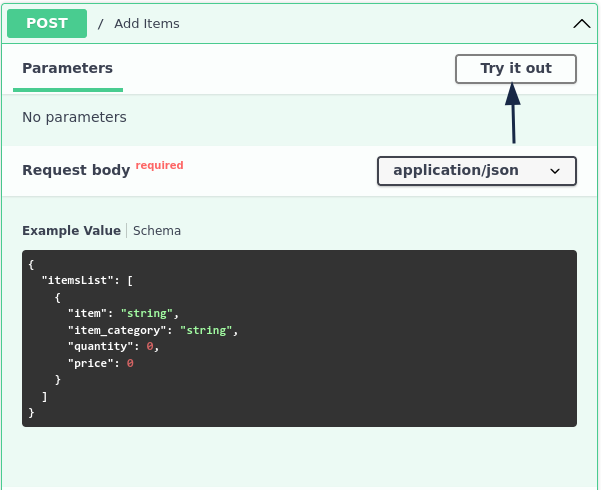
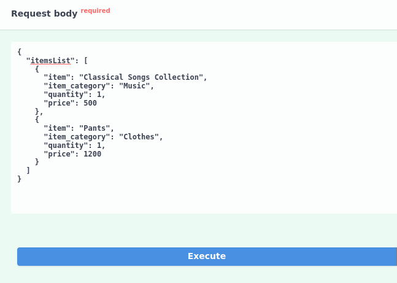
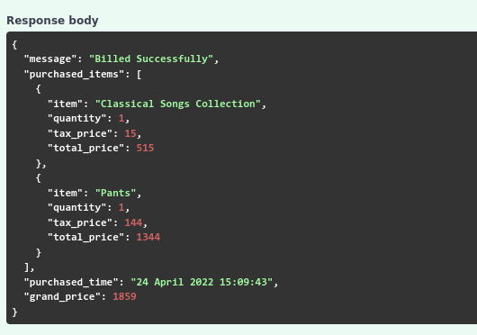
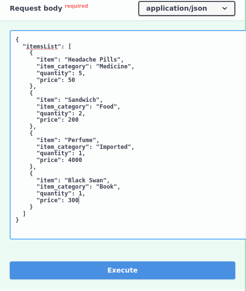
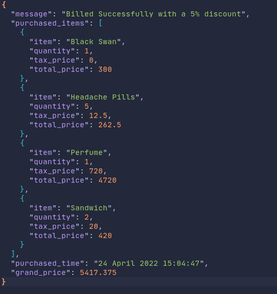

# shopping-list

## About

A RESTful api written using FASTApi, that generates a bill for a given list of items.


## Live instance

Check out the live instance on [heroku](https://lit-hamlet-51731.herokuapp.com/docs#/default/add_items__post)

## Usage Instructions

+ Click on Try it out



+ Add items and then click on execute.



+ Request Response




+ **Example Input**



+ **Output**



## Running in a Local Environment

To run in a local environment, first clone this repository using git.

```
git clone https://github.com/Rakshith-SS/shopping-list.git
```

Then install the python packages using the **requirements.txt**

```
pip install -r requirements.txt
```

Then run the uvicorn server

```
uvicorn main:app --reload
```

Then go to this link [localhost:8000/docs](http://127.0.0.1:8000/docs#/default/add_items__post) in the browser to make requests and get responses.

